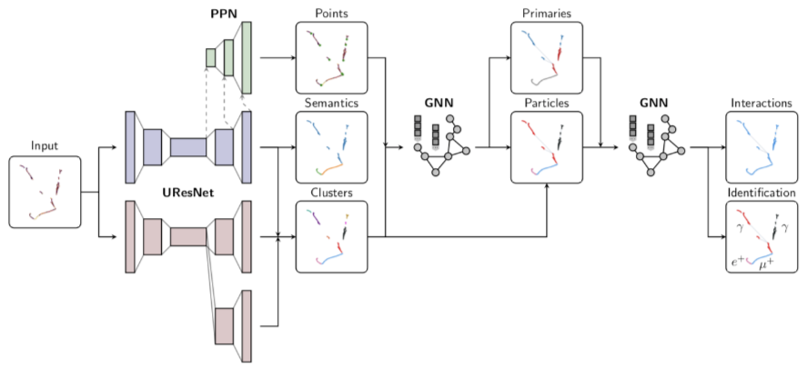

[](https://travis-ci.com/DeepLearnPhysics/lartpc_mlreco3d)

[](https://lartpc-mlreco3d.readthedocs.io/en/latest/?badge=latest)

# A Machine Learning Pipeline for LArTPC Data

This repository contains code used for training and running machine learning models on LArTPC data.



## Installation
We recommend using a Singularity or Docker containers pulled from `deeplearnphysics/larcv2`: https://hub.docker.com/r/deeplearnphysics/larcv2. It needs to have at least
* MinkowskiEngine,
* larcv2,
* pytorch_geometric,
* PyTorch,
* standard Python scientific libraries.

Then git clone this repository and have fun!

## Usage
Basic example:
```python
# assume that lartpc_mlreco3d folder is on python path
from mlreco.main_funcs import process_config, train
import yaml
# Load configuration file
with open('lartpc_mlreco3d/config/train_uresnet.cfg', 'r') as f:
    cfg = yaml.load(f, Loader=yaml.Loader)
process_config(cfg)
# train a model based on configuration
train(cfg)
```

* Some tutorials are available at https://deeplearnphysics.org/lartpc_mlreco3d_tutorials/.
* More technical documentation is available at https://lartpc-mlreco3d.readthedocs.io/.

### Example Configuration Files

For your inspiration, the following standalone configurations are available in the `config` folder:

| Configuration name            | Model          |
| ------------------------------|----------------|
| `train_uresnet.cfg`           | UResNet alone  |
| `train_uresnet_ppn.cfg`       | UResNet + PPN  |
| `train_graph_spice.cfg`       | GraphSpice     |
| `train_grappa_shower.cfg`     | GrapPA for shower fragments clustering (particle fragments -> particle clusters) |
| `train_grappa_interaction.cfg`| GrapPA for interaction clustering (particle clusters -> interactions) |

Switching from train to test mode is as simple as switching `trainval.train: False` for all models. The only exception at the moment is GraphSpice, for which an example test configuration is provided (`test_graph_spice.cfg`).

Typically in a configuration file the first things you may want to edit will be:
* `batch_size` (in 2 places)
* `weight_prefix` (where to save the model checkpoints)
* `log_dir` (where to save the logs)
* `iterations`
* `model_path` (checkpoint to load, optional)
* `train` (boolean)
* `gpus` (leave empty '' if you want to run on CPU)


If you want more information stored, such as network output tensors and post-processing outcomes, you can use `analysis` (scripts) and `outputs` (formatters)
to store them in CSV format and run your custom analysis scripts (see folder `analysis`).

This section has described how to use the contents of this repository to train variations of what has already been implemented.  To add your own models and analysis, you will want to know how to contribute to the `mlreco` module.

### Running A Configuration File

Most basic usage is to use the `run` script.  From the `lartpc_mlreco3d` folder:
```bash
nohup python3 bin/run.py train_gnn.cfg >> log_gnn.txt &
```
This will train a GNN specified in `config/train_gnn.cfg`, save checkpoints and logs to specified directories in the `cfg`, and output `stderr` and `stdout` to `log_gnn.txt`

You can generally load a configuration file into a python dictionary using
```python
import yaml
# Load configuration file
with open('lartpc_mlreco3d/config/train_uresnet.cfg', 'r') as f:
    cfg = yaml.load(f, Loader=yaml.Loader)
```

### Reading a Log

A quick example of how to read a training log, and plot something
```python
import pandas as pd
import matplotlib.pyplot as plt
fname = 'path/to/log.csv'
df = pd.read_csv(fname)

# plot moving average of accuracy over 10 iterations
df.accuracy.rolling(10, min_periods=1).mean().plot()
plt.ylabel("accuracy")
plt.xlabel("iteration")
plt.title("moving average of accuracy")
plt.show()

# list all column names
print(df.columns.values)
```

### Recording network output or running analysis
We use [LArTPC MLReco3D Analysis Tools](./analysis/README.md) for all inference and high-level analysis related work. 

## Repository Structure
* `bin` contains very simple scripts that run the training/inference functions.
* `config` has various example configuration files.
* `docs` Documentation (in progress)
* `mlreco` the main code lives there!
* `test` some testing using Pytest
* `analysis`: [LArTPC MLReco3D Analysis Tools](./analysis/README.md), a pure python interface for inference, high-level analysis, and visualization using the full chain. 

Please consult the README of each folder respectively for more information.

## Contributing

Before you start contributing to the code, please see the [contribution guidelines](contributing.md).

### Adding a new model
You may be able to re-use a fair amount of code, but here is what would be necessary to do everything from scratch:

1. Make sure you can load data you need.

Parsers already exist for a variety of sparse tensor outputs as well as particle outputs.

The most likely place you would need to add something is to `mlreco/iotools/parsers.py`.

If the data you need is fundamentally different from data currently used, you may also need to add a collation function to `mlreco/iotools/collates.py`

2. Include your model

You should put your model in a new file in the `mlreco/models` folder.

Add your model to the dictionary in `mlreco/models/factories.py` so it can be found by the configuration parsers.

At this point, you should be able to train your model using a configuration file.
